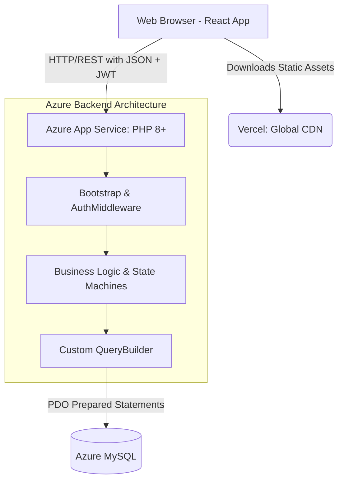

# 🔧 FixGo Web Application

> **Note:** The live Azure backend deployment has been temporarily spun down to conserve student hosting credits, but the full source code, decoupled architecture, and automated GitHub Actions deployment pipelines remain intact in this repository.


FixGo is a decoupled, cloud-ready platform connecting vehicle owners with service centers, featuring an automated billing engine and a custom-built PHP MVC architecture.

---

## 🏛️ System Architecture

Our infrastructure is strictly decoupled to ensure scalability, security, and separate deployment lifecycles.



### 🧠 Educational Philosophy: "No Black Boxes"
While industry standards heavily favor frameworks like Laravel or Symfony, the backend of this project was deliberately built using **Vanilla PHP 8+** to demonstrate a deep understanding of core architectural mechanics. By avoiding the "magic" of frameworks, this project features:
*   **Custom MVC Routing:** Handling raw HTTP requests via a custom `bootstrap.php` pipeline instead of a framework router.
*   **Custom Middleware:** An `AuthMiddleware` class built from scratch to verify JWTs and enforce Role-Based Access Control (RBAC).
*   **Custom Query Builder:** A bespoke fluent PDO interface (`$this->qb->table()->where()`) to abstract SQL injection protection without relying on an ORM like Eloquent.
*   **Custom Schema Migrations:** A bespoke `migrate.php` script to handle idempotent database generation for CI/CD cloud environments.
*   **Custom Payload Parsing:** A `RequestValidator` that manually decodes raw `php://input` JSON streams and Base64 multipart file boundaries.

### ⚡ Key Engineering Features
*   **Cloud-Native Infrastructure:** Designed for stateless deployment, utilizing Azure App Service (PaaS) for the backend and Vercel for the edge-cached frontend, relying on environment variable injection to protect production secrets.
*   **Automated GitOps (CI/CD):** Pushes to the `development` branch automatically trigger GitHub Actions to run PHPUnit integration tests. Successful builds trigger deployment webhooks to Vercel and Azure.
*   **Robust Security:** Implements centralized JWT-based Role-Based Access Control (RBAC), strict MIME-type file upload validation, CORS domain restrictions, and enforces SSL/TLS encryption for cloud database connections.
*   **Strict State Machine Integrity:** The application enforces complex business rules (like a 5-state billing lifecycle and a 3-way service request handshake) strictly through controller boundaries.

---

## 📚 Documentation Directory

For deep-dive technical details and contribution rules, please refer to our dedicated documentation:

*   [**Architecture Guide**](docs/ARCHITECTURE.md): The full breakdown of the HTTP Request Lifecycle and MVC pattern.
*   [**API Contract**](docs/API_CONTRACT.md): The interface, payload structures, and status codes for front-to-back communication.
*   [**Contributing Guidelines**](CONTRIBUTING.md): The mandatory "Golden Rules" and PR workflow.

---

## 🚀 Getting Started (Local Development)

You can run FixGo locally using either Docker (recommended for consistency) or directly on your host machine.

### Method A: Docker (Recommended - Cross Platform)
Docker works seamlessly across Windows, macOS, and Linux. Ensure Docker Engine or Docker Desktop is running.
1. Clone the repository and navigate to the root directory.
2. **Important:** Configure your `.env` files for both the frontend and backend first (see Steps 1 & 2 in Method B below).
3. Run the Docker Compose command:
   ```bash
   docker-compose up -d --build
   ```
4. The frontend will be available at `http://localhost:5173` and the backend at `http://localhost:8000`.

### Method B: Bare Metal (Host Machine)
Ensure you have PHP 8+, Composer, Node.js, and MySQL installed.

**1. Configure the Backend Environment**
Navigate to the `backend/` directory, copy `.env.example` to `.env`, and update your private credentials (Database and SMTP):
```env
DB_HOST=localhost
DB_NAME=fixgo_web
DB_USER=your_database_user
DB_PASS=your_database_password

SMTP_USER=your_email@gmail.com
SMTP_PASS=your_app_password
```

**2. Configure the Frontend Environment**
Navigate to the `frontend/` directory, copy `.env.example` to `.env`, and insert your API keys:
```env
VITE_API_URL=http://localhost:8000
VITE_GOOGLE_MAPS_API_KEY=your_actual_api_key_here
```

**3. Create the Database**
Open phpMyAdmin or your MySQL client and create a new, empty database named `fixgo_web` (or whatever you set as `DB_NAME`).

**4. Start the Backend**
```bash
cd backend/
composer install
php database/migrate.php
php -S localhost:8000
```

**5. Start the Frontend**
Open a new terminal window:
```bash
cd frontend/
npm install
npm run dev
```
Open your browser to `http://localhost:5173`.
